```{r setup, include=FALSE}
options(htmltools.dir.version = FALSE)
```

```{r xaringan-tile-view, echo=FALSE}
xaringanExtra::use_tile_view()
```


```{r xaringan-panelset, echo=FALSE}
xaringanExtra::use_panelset()
```

```{r, echo=FALSE}
xaringanExtra::use_webcam()
```

```{r xaringan-fit-screen, echo=FALSE}
xaringanExtra::use_fit_screen()
```

## Plot 1: 

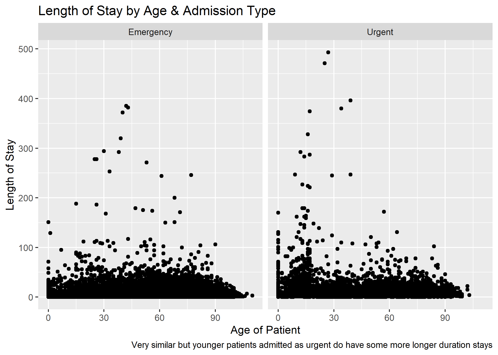


---
## Plot 2: 


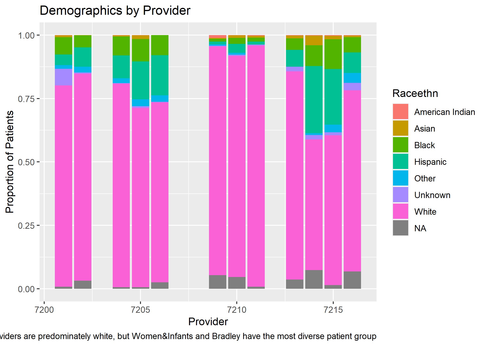
---
## Plot 3: 


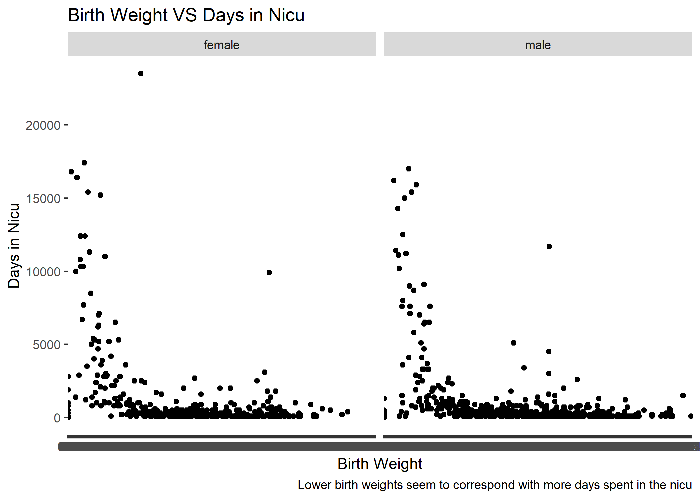
---
## Plot 4: 


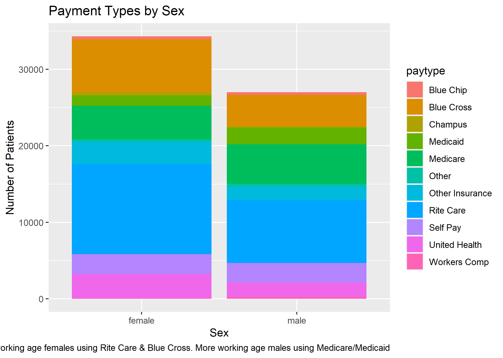
---
## Plot 5: 


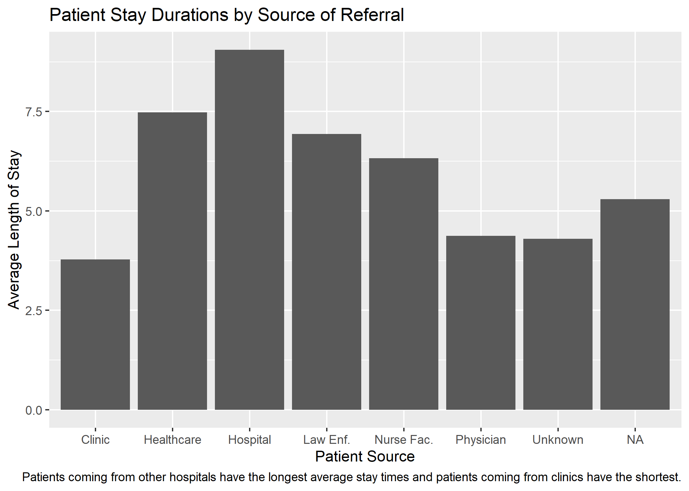
---
## Plot 6: 


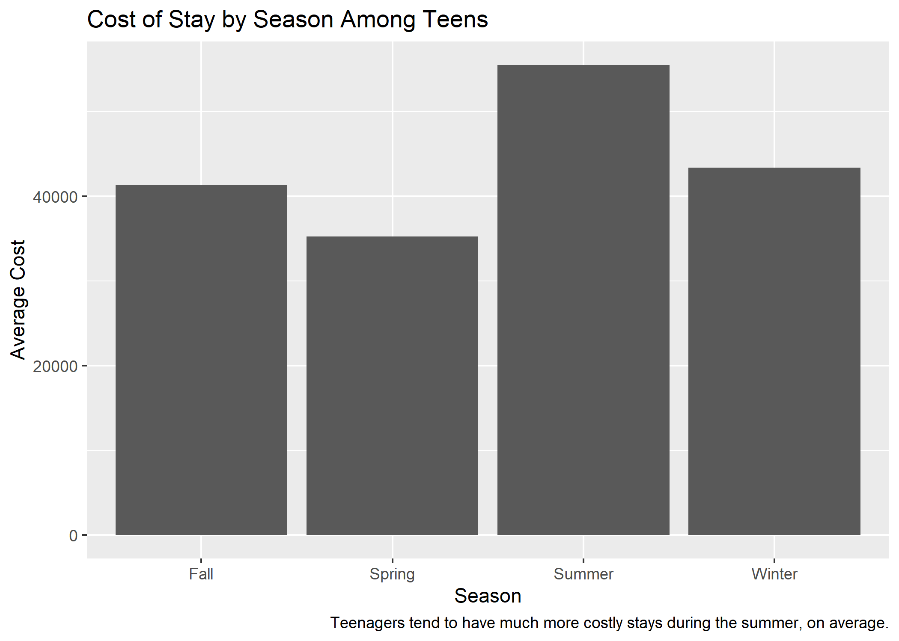

---
## Plot 7: 


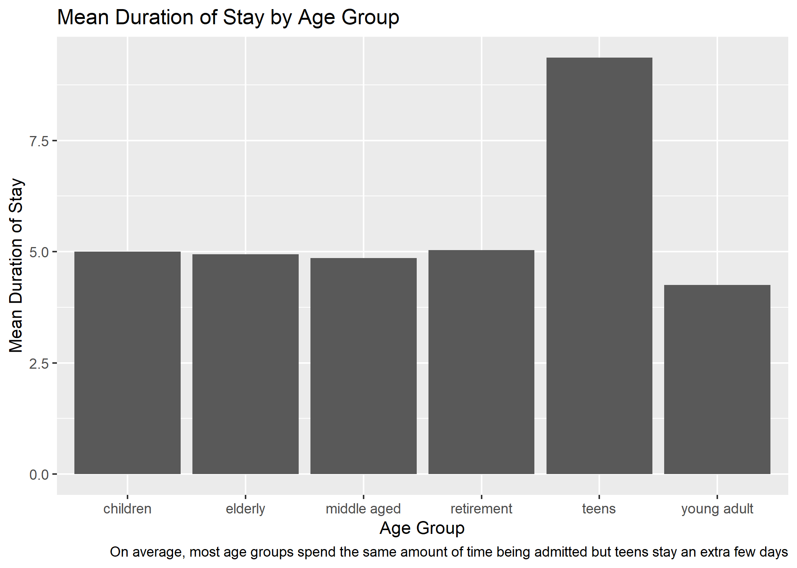

---
## Plot 8: 


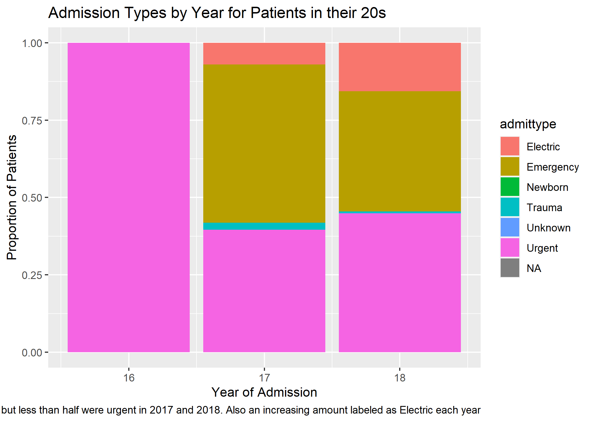
---
## Plot 9: 


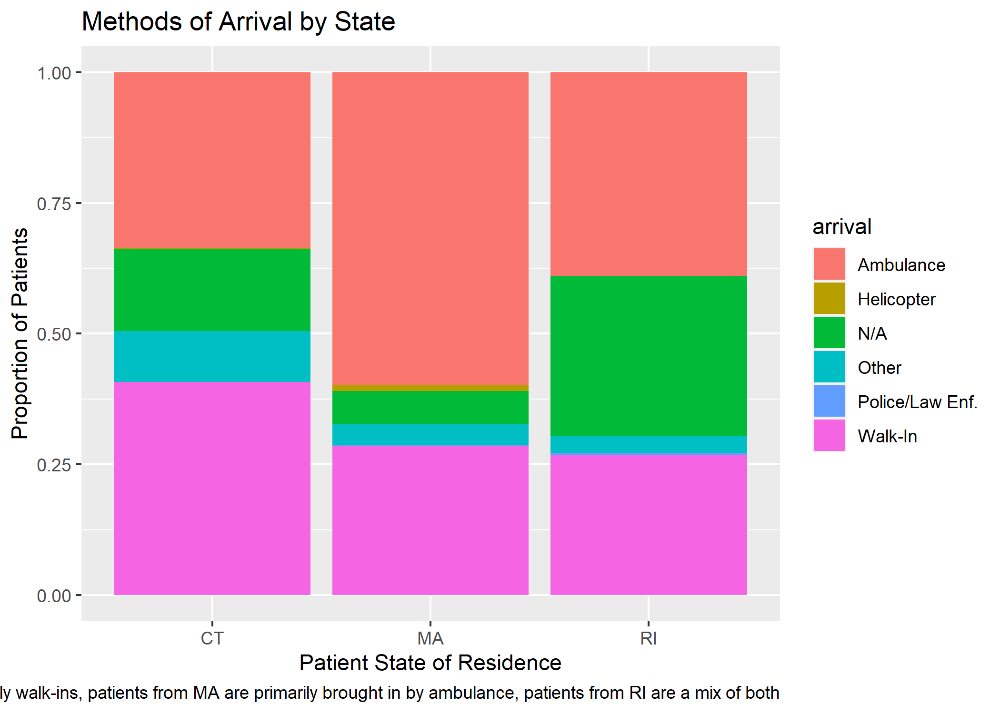
---
## Plot 10: 


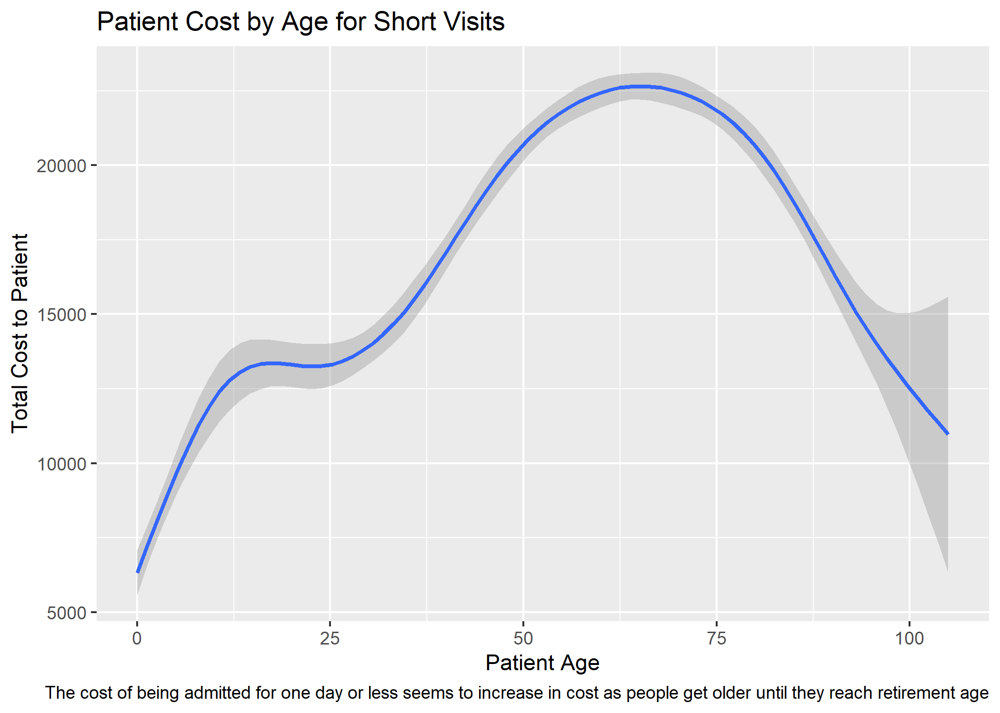

---
##Animation: Top sources of payment covering total costs by provider

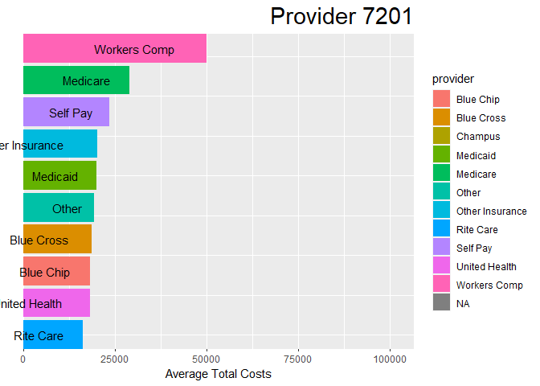

---

## Model Comparison for tot target variable

```{r}
```{r, include=FALSE}
library(tidyverse)
df <- read_csv('midterm.jakecardines.csv')

df <- df %>%  select(-yod, -payfix, -pay_ub92, -yoa, - asource, -preopday, -service, -icu, -ccu, -dispub92, -payer, -drg, -trandb, -randbg, -randbs, -orr, -anes, -seq, -lab, -dtest, -ther, -blood, -phar, -other, -patcon, -bwght, -total, -ecodub92, -b_wt, -pt_state, -diag_adm, -ancilar, -er_fee, -er_chrg, -er_mode, -obs_chrg, -obs_hour, -psycchrg, -nicu_day)

median(df$tot)

df$target <- case_when(df$tot < 21854 ~ 'low', TRUE ~ 'high')

write_csv(df, 'midtermpt3.jakecardines.csv')


```
```{r,include=FALSE}
df <- df %>% select(-tot)
```

```{r, include = FALSE}
df <- df %>% 
  filter(!is.na(raceethn)) %>% 
  filter(!is.na(admtype)) %>% 
  filter(sex <=2) %>% 
  filter(!is.na(admtype)) %>% 
  filter(admtype <9)
  

 df$sex <- case_when(df$sex %in% c(1) ~ 'Male',
  df$sex %in% c(2)~ 'Female',df$sex %in% c(9)~ 'Unknown')  

df$raceethn <- case_when(df$raceethn %in% c(1) ~ 'White',
  df$raceethn %in% c(2)~ 'Black', df$raceethn %in% c(3) ~ 'Asian', df$raceethn %in% c(4) ~ 'American Indian',
  df$raceethn %in% c(5)~ 'Native Hawaiian', df$raceethn %in% c(6) ~ 'Other', df$raceethn %in% c(7) ~ 'Hispanic',
  df$raceethn %in% c(9)~ 'Unknown')

df$provider <- case_when(df$provider %in% c(7201) ~ 'Newport',
  df$provider %in% c(7202)~ 'St. Joseph Health Services of RI', df$provider %in% c(7203) ~ 'Memorial', df$provider %in% c(7204) ~ 'Miriam',
  df$provider %in% c(7205)~ 'Rhode Island Hospital', df$provider %in% c(7206) ~ 'Roger Williams', df$provider %in% c(7209) ~ 'South County',
  df$provider %in% c(7210)~ 'Kent County', df$provider %in% c(7211)~ 'Westerly', df$provider %in% c(7212) ~ 'Rehab of RI', df$provider %in% c(7213) ~ 'Landmark Medical Center',
  df$provider %in% c(7214)~ 'Women and Infants', df$provider %in% c(7215)~ 'Bradley', df$provider %in% c(7216)~ 'Butler')


df$admtype <- case_when(df$admtype %in% c(1) ~ 'Emergency',
  df$admtype %in% c(2)~ 'Urgent', df$admtype %in% c(3) ~ 'Electric', df$admtype %in% c(4) ~ 'Newborn',
  df$admtype %in% c(5)~ 'Trauma',
  df$admtype %in% c(9)~ 'Not Available')


df$campus <- case_when(df$campus %in% c(0) ~ 'Hospital Has Only One Premise',
  df$campus %in% c(1)~ 'St. Joseph Health Services of Rhode 
       Island – Our Lady of Fatima 
       Hospital', df$campus %in% c(2) ~ 'St. Joseph Health Services of Rhode 
      Island – St. Joseph Hospital for  
     Specialty Care', df$campus %in% c(3) ~ 'Rhode Island Hospital - Adult')


 df %>%  mutate(target = as.factor(target),
         age = as.numeric(age),
         sex = as.factor(sex),
         raceethn = as.factor(raceethn), 
         provider = as.factor(provider),
         moa = as.numeric(moa),
         mod = as.numeric(mod),
         admtype = as.factor(admtype),
         campus = as.factor(campus),
         los = as.numeric(los))
```
```{r, include = FALSE}
df$campus <- NULL
library(caret)
 
splitIndex <- createDataPartition(df$target, p = .10, 
                                  list = FALSE)
df_train <- df[ splitIndex,]
df_test <- df[-splitIndex,]
```
```{r, include = FALSE}
library(caret)
library(mlbench)

trControl = trainControl(method = "cv",
                         number = 5)
forest_ranger <- train(target~., data=df_train, 
                    method = "ranger", trControl = trControl, na.action = na.omit)
pred <- predict(forest_ranger, df_test)
cm <- confusionMatrix(data = pred, reference = as.factor(df_test$target))
cm$overall
print(forest_ranger)

trControl = trainControl(method = "cv",
                         number = 5)
tuneGrid = expand.grid(mtry = 2:4,
                       splitrule = c('gini', 'extratrees'),
                       min.node.size = c(1:10))
forest_ranger <- train(target~., data=df_train, 
                    method = "ranger", 
                    trControl = trControl,
                    tuneGrid = tuneGrid)
plot(forest_ranger)
```
```{r, include = FALSE}
trControl = trainControl(method = "cv",
                         number = 5)
GLM <- train(target~., data=df_train, 
                    method = "glmnet", trControl = trControl)
pred <- predict(GLM, df_test)
cm <- confusionMatrix(data = pred, reference = as.factor(df_test$target))
cm$overall
print(GLM)

getModelInfo('glmnet')$glmnet$parameters

trControl = trainControl(method = "cv",
                         number = 5)
tuneGrid = expand.grid(alpha = c(0:1),
                       lambda = c(0:1))
GLM <- train(target~., data=df_train, 
                    method = "glmnet", 
                    trControl = trControl,
                    tuneGrid = tuneGrid)
plot(GLM)


```
```{r, include= FALSE}
trControl = trainControl(method = "cv",
                         number = 5)
FDA <- train(target~., data=df_train, 
                    method = "fda", trControl = trControl)
pred <- predict(FDA, df_test)
cm <- confusionMatrix(data = pred, reference = as.factor(df_test$target))
cm$overall
print(FDA)

getModelInfo('fda')$fda$parameters

trControl = trainControl(method = "cv",
                         number = 5)
tuneGrid = expand.grid(degree = c(1:2),
                       nprune = c(1:15))
FDA <- train(target~., data=df_train, 
                    method = "fda", 
                    trControl = trControl,
                    tuneGrid = tuneGrid)
plot(FDA)


```


```{r, include = FALSE}
trControl = trainControl(method = "cv",
                         number = 5)
GLM <- train(target~., data=df_train, 
                                method = "glmnet", 
                                trControl = trControl)
forest_ranger <- train(target~., data=df_train, 
                    method = "ranger", 
                                trControl = trControl)
FDA <- train(target~., data=df_train, 
                                method = "fda", 
                                trControl = trControl)
results <- resamples(list('GLM' = GLM,
                          'Random Forest' = forest_ranger,
                          'FDA'= FDA))
```


```{r}
bwplot(results)
```


---
##Best of First Models & Accuracy on Test Data

Ranger method produced best results on test data!
```{r}
pred <- predict(forest_ranger, df_test)
cm <- confusionMatrix(data = pred, reference = as.factor(df_test$target))


cm$overall[1]
```
---
##New target variable (based on los)

- los of less than 5 days is short
- los of more than 5 days is long

---
##Model Comparison for los target variable

```{r, include = FALSE}
df <- read_csv('midterm.jakecardines.csv')

df <- df %>%  select(-yod, -payfix, -pay_ub92, -yoa, - asource, -preopday, -service, -icu, -ccu, -dispub92, -payer, -drg, -trandb, -randbg, -randbs, -orr, -anes, -seq, -lab, -dtest, -ther, -blood, -phar, -other, -patcon, -bwght, -total, -ecodub92, -b_wt, -pt_state, -diag_adm, -ancilar, -er_fee, -er_chrg, -er_mode, -obs_chrg, -obs_hour, -psycchrg, -nicu_day)


df$target <- case_when(df$los < 5 ~ 'short', TRUE ~ 'long')

write_csv(df, 'midtermpt3q6.jakecardines.csv')
```

```{r, include = FALSE}
df <- df %>% select(-los)
```


```{r, include = FALSE}
df <- df %>% 
  filter(!is.na(raceethn)) %>% 
  filter(!is.na(admtype)) %>% 
  filter(sex <=2) %>% 
  filter(!is.na(admtype)) %>% 
  filter(admtype <9)
  

 df$sex <- case_when(df$sex %in% c(1) ~ 'Male',
  df$sex %in% c(2)~ 'Female',df$sex %in% c(9)~ 'Unknown')  

df$raceethn <- case_when(df$raceethn %in% c(1) ~ 'White',
  df$raceethn %in% c(2)~ 'Black', df$raceethn %in% c(3) ~ 'Asian', df$raceethn %in% c(4) ~ 'American Indian',
  df$raceethn %in% c(5)~ 'Native Hawaiian', df$raceethn %in% c(6) ~ 'Other', df$raceethn %in% c(7) ~ 'Hispanic',
  df$raceethn %in% c(9)~ 'Unknown')

df$provider <- case_when(df$provider %in% c(7201) ~ 'Newport',
  df$provider %in% c(7202)~ 'St. Joseph Health Services of RI', df$provider %in% c(7203) ~ 'Memorial', df$provider %in% c(7204) ~ 'Miriam',
  df$provider %in% c(7205)~ 'Rhode Island Hospital', df$provider %in% c(7206) ~ 'Roger Williams', df$provider %in% c(7209) ~ 'South County',
  df$provider %in% c(7210)~ 'Kent County', df$provider %in% c(7211)~ 'Westerly', df$provider %in% c(7212) ~ 'Rehab of RI', df$provider %in% c(7213) ~ 'Landmark Medical Center',
  df$provider %in% c(7214)~ 'Women and Infants', df$provider %in% c(7215)~ 'Bradley', df$provider %in% c(7216)~ 'Butler')


df$admtype <- case_when(df$admtype %in% c(1) ~ 'Emergency',
  df$admtype %in% c(2)~ 'Urgent', df$admtype %in% c(3) ~ 'Electric', df$admtype %in% c(4) ~ 'Newborn',
  df$admtype %in% c(5)~ 'Trauma',
  df$admtype %in% c(9)~ 'Not Available')


df$campus <- case_when(df$campus %in% c(0) ~ 'Hospital Has Only One Premise',
  df$campus %in% c(1)~ 'St. Joseph Health Services of Rhode 
       Island – Our Lady of Fatima 
       Hospital', df$campus %in% c(2) ~ 'St. Joseph Health Services of Rhode 
      Island – St. Joseph Hospital for  
     Specialty Care', df$campus %in% c(3) ~ 'Rhode Island Hospital - Adult')


 df %>%  mutate(target = as.factor(target),
         age = as.numeric(age),
         sex = as.factor(sex),
         raceethn = as.factor(raceethn), 
         provider = as.factor(provider),
         moa = as.numeric(moa),
         mod = as.numeric(mod),
         admtype = as.factor(admtype),
         campus = as.factor(campus),
         tot = as.numeric(tot))
```
```{r, include = FALSE}
df$campus <- NULL
library(caret)
 
splitIndex <- createDataPartition(df$target, p = .10, 
                                  list = FALSE)
df_train <- df[ splitIndex,]
df_test <- df[-splitIndex,]

```
```{r, include = FALSE}
trControl = trainControl(method = "cv",
                         number = 5)
forest_ranger <- train(target~., data=df_train, 
                    method = "ranger", trControl = trControl, na.action = na.omit)
pred <- predict(forest_ranger, df_test)
cm <- confusionMatrix(data = pred, reference = as.factor(df_test$target))
cm$overall
print(forest_ranger)

trControl = trainControl(method = "cv",
                         number = 5)
tuneGrid = expand.grid(mtry = 2:4,
                       splitrule = c('gini', 'extratrees'),
                       min.node.size = c(1:10))
forest_ranger <- train(target~., data=df_train, 
                    method = "ranger", 
                    trControl = trControl,
                    tuneGrid = tuneGrid)
plot(forest_ranger)
```
```{r, include = FALSE}
trControl = trainControl(method = "cv",
                         number = 5)
GLM <- train(target~., data=df_train, 
                    method = "glmnet", trControl = trControl)
pred <- predict(GLM, df_test)
cm <- confusionMatrix(data = pred, reference = as.factor(df_test$target))
cm$overall
print(GLM)

trControl = trainControl(method = "cv",
                         number = 5)
tuneGrid = expand.grid(alpha = c(0:1),
                       lambda = c(0:1))
GLM <- train(target~., data=df_train, 
                    method = "glmnet", 
                    trControl = trControl,
                    tuneGrid = tuneGrid)
plot(GLM)
```
```{r, include = FALSE}
trControl = trainControl(method = "cv",
                         number = 5)
FDA <- train(target~., data=df_train, 
                    method = "fda", trControl = trControl)
pred <- predict(FDA, df_test)
cm <- confusionMatrix(data = pred, reference = as.factor(df_test$target))
cm$overall
print(FDA)

trControl = trainControl(method = "cv",
                         number = 5)
tuneGrid = expand.grid(degree = c(1:2),
                       nprune = c(1:15))
FDA <- train(target~., data=df_train, 
                    method = "fda", 
                    trControl = trControl,
                    tuneGrid = tuneGrid)
plot(FDA)
```
```{r, include = FALSE}
trControl = trainControl(method = "cv",
                         number = 5)
GLM <- train(target~., data=df_train, 
                                method = "glmnet", 
                                trControl = trControl)
forest_ranger <- train(target~., data=df_train, 
                    method = "ranger", 
                                trControl = trControl)
FDA <- train(target~., data=df_train, 
                                method = "fda", 
                                trControl = trControl)
results <- resamples(list('GLM' = GLM,
                          'Random Forest' = forest_ranger,
                          'FDA'= FDA))

```
```{r}
bwplot(results)
```


---
##Best of Second Models & Accuracy on Test Data
Ranger method again produced best results on test data!
```{r}
pred <- predict(forest_ranger, df_test)
cm <- confusionMatrix(data = pred, reference = as.factor(df_test$target))


cm$overall[1]
```

---
##Challenges & Errors
- Campus variable: tried to remove missing values with filter and drop_na but was still creating error, dropped variable

- Filtering for plots: many variables had too much data to use 

- Saving animation plot: kept saving as blank until I discovered anim_save and used .gif instead of .png

- Small errors (forgetting a df or putting %>%  in the wrong place) 
